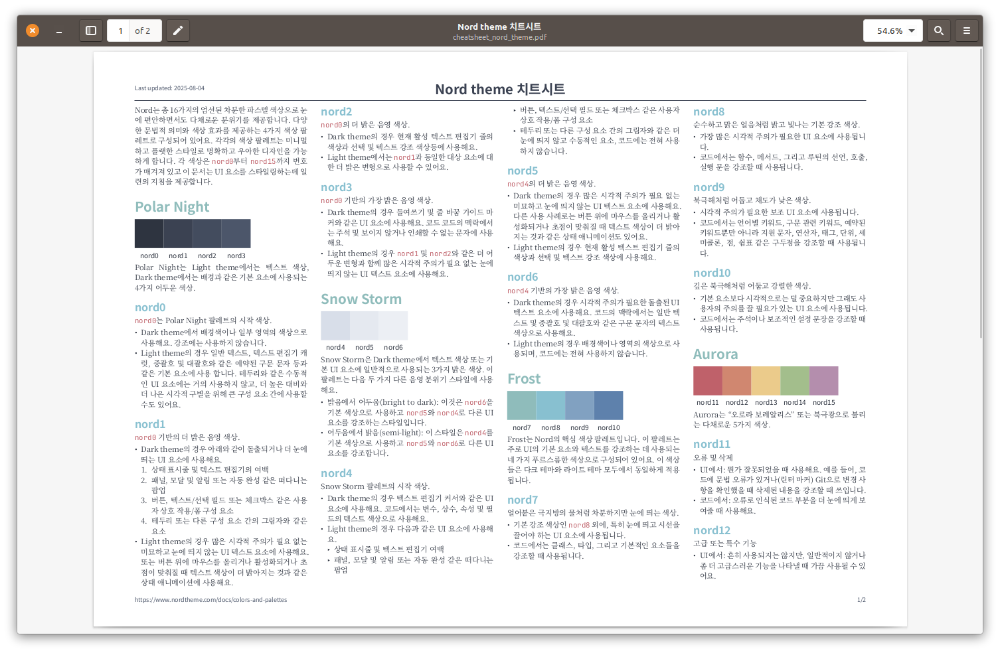

# 각종 치트 시트 모음🤗




## 🚀 소개

이 저장소는 다양한 프로그래밍 언어 및 데이터 과학 도구에 대한 저의 개인적인 치트시트 모음입니다. 모든 치트시트는 현대적이고 강력한 조판 시스템인 Typst 문서로 작성되었습니다. 각 치트시트는 빠른 참조, 핵심 개념 상기, 그리고 효율적인 학습을 돕기 위해 간결하고 명확하게 정리되어 있습니다.

개발자, 데이터 과학자, 학생 등 코딩과 데이터에 관심 있는 모든 분들이 이 자료를 통해 작업 효율성을 높이고 새로운 지식을 습득하는 데 도움을 받으시길 바랍니다.


## 📥 PDF 다운로드

각 치트시트의 PDF 버전은 릴리즈 페이지에 자동으로 업로드됩니다. 가장 최신 버전의 치트시트를 손쉽게 확인하고 다운로드하여 오프라인에서도 편리하게 활용하세요.


## ✨ 주요 치트시트 목록

현재 제공되는 주요 치트시트는 다음과 같습니다. 앞으로도 유용한 자료들이 계속 추가될 예정입니다.

- Go 언어 ([`src/cheatsheet_go.typ`](src/cheatsheet_go.typ)):
  - Go 언어의 기본 문법, 패키지 관리, 고루틴(Goroutines), 채널(Channels) 등 병행성(concurrency) 핵심 개념을 명확하게 정리했습니다. 분산 시스템 개발에 관심 있는 분들께 유용합니다.
- Seurat ([`src/cheatsheet_seurat.typ`](src/cheatsheet_seurat.typ)):
  - R 기반의 단일 세포 RNA 시퀀싱(scRNA-seq) 분석 도구인 Seurat의 주요 명령어 및 표준 워크플로우를 다룹니다. 생물정보학 연구자들에게 필수적인 자료입니다.
- Tidyverse ([`src/cheatsheet_tidyverse.typ`](src/cheatsheet_tidyverse.typ)):
  - R 데이터 분석을 위한 Tidyverse 패키지 모음의 핵심 사용법(dplyr, ggplot2, tidyr 등)을 안내합니다. 데이터 전처리, 변환, 시각화에 대한 가이드라인을 제공합니다.
- Typst 문법 ([`src/cheatsheet_typst_syntax.typ`](src/cheatsheet_typst_syntax.typ)):
  - 새로운 조판 시스템 Typst로 문서를 작성하기 위한 기본 문법, 레이아웃 조작, 수식 작성, 예제 코드 등을 포함합니다. 아름다운 문서를 만들고 싶은 분들께 강력 추천합니다.
- 기타: Python, mypy, nvim 등 다양한 도구와 언어에 대한 치트시트가 포함되어 있습니다. 특정 주제에 대한 치트시트가 필요하다면 `src/` 디렉토리를 탐색해보세요.


## 🛠️ Typst 문서 빌드 방법

Typst 문서를 직접 빌드하여 PDF 또는 다른 형식으로 변환할 수 있습니다.

1.  pixi를 사용하여 Typst를 설치합니다. pixi는 프로젝트별 종속성을 관리하는 데 유용합니다.
    ```bash
    pixi install
    ```
    (만약 pixi를 사용하지 않고 전역으로 Typst를 설치하고 싶다면, Typst 공식 설치 가이드를 참고하세요.)
2.  설치가 완료되면, 원하는 `.typ` 파일을 Typst 컴파일러로 PDF 등 다양한 형식으로 변환할 수 있습니다.
    ```bash
    pixi run typst compile --font-path "src/fonts" src/cheatsheet_go.typ
    ```
    위 명령은 `src/cheatsheet_go.typ` 파일을 `cheatsheet_go.pdf`로 컴파일합니다. 필요에 따라 출력 파일명과 경로를 조정할 수 있습니다.


## 🤝 기여 방법

이 프로젝트는 오픈 소스 기여를 환영합니다. 여러분만의 유용한 치트시트를 추가하거나 기존 치트시트를 개선하는 데 참여하실 수 있습니다.

1.  이 저장소를 포크(Fork)하세요.
2.  포크한 저장소를 로컬로 클론(Clone)하세요.
3.  새로운 `.typ` 파일을 추가하거나 기존 파일을 수정하세요.
4.  변경 사항을 커밋(Commit)하고 푸시(Push)하세요.
5.  이 저장소로 풀 리퀘스트(Pull Request)를 생성하세요.
6.  여러분의 기여가 병합되기를 기다리세요.

자세한 기여 가이드라인은 [CONTRIBUTING.md](./CONTRIBUTING.md) 파일을 참고해주세요. 여러분의 참여는 이 저장소를 더욱 풍성하게 만듭니다.


## 📜 라이선스

이 프로젝트는 MIT License를 따릅니다.
자세한 내용은 [LICENSE](./LICENSE) 파일을 참고하세요. 자유롭게 사용하고, 수정하고, 배포할 수 있습니다.
